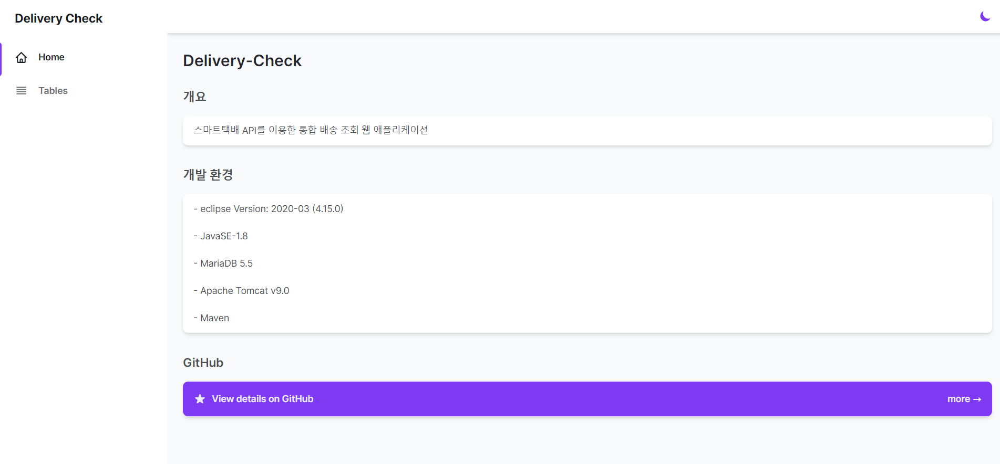
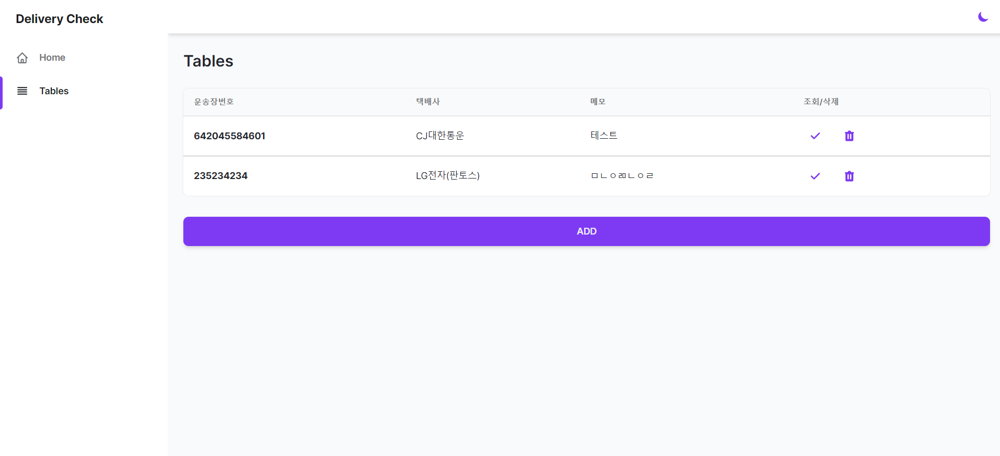
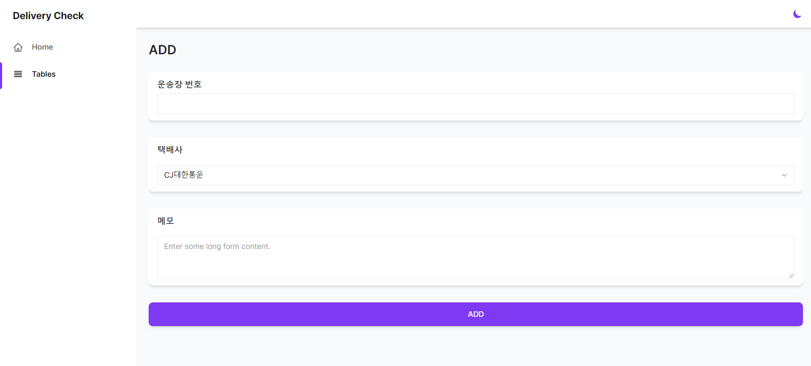
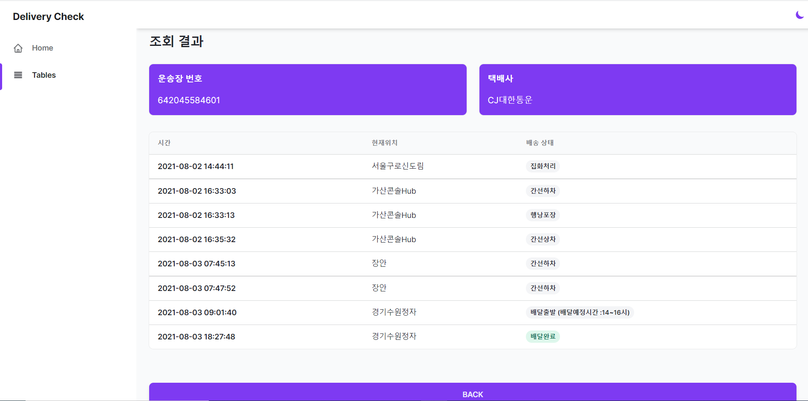

# Delivery-Check


## 개요

스마트택배 API를 이용한 통합 배송 조회 웹 애플리케이션


## 개발 환경

- eclipse Version: 2020-03 (4.15.0)

- JavaSE-1.8

- MariaDB 5.5

- Apache Tomcat v9.0

- Maven


## DB schema

##### delivery.wayvill
|이름|데이터 유형(길이)|NULL 허용|기본값|설명|
|:-:|:-:|:-:|:-:|:-:|
|id|INT(12)|NOT NULL|AUTO_INCREASEMENT|PK|
|wayvill|VARCHAR(15)|NOT NULL|-|운송장 번호|
|code|VARCHAR(5)|NOT NULL|-|택배사 코드|
|company|VARCHAR(15)|NOT NULL|-|택배사 이름|
|memo|VARCHAR(100)|NULL|-|메모|


## 구성 화면

##### index.jsp


##### list.jsp


##### add.jsp


##### search.jsp


##### 사용 템플릿
https://github.com/estevanmaito/windmill-dashboard


## 사용시 수정 사항

##### API KEY 
> 스마트 택배 API KEY 발급처: https://tracking.sweettracker.co.kr/
> 
> src/control/Control.java 수정해서 사용     

```java
private final static String KEY = "#";
```


##### DB id 및 password 
> src/dbconn/DBUtil.java 수정해서 사용

```java
String user = "#"; 
String pw = "#";
String url = "jdbc:mariadb://127.0.0.1:3306/#";
```

